# Proje Detayları
Kullanıcılar siteye girerek anasayfadaki ürünlerin tamamını görebilir, ürün detaylarına gidebilir veya kategori seçerek ilgili kategorilerdeki ürünlere ulaşabilir. Bunun dışında giriş yapmadan yapabileceği işlemler siteye kayıt, giriş işlemleri ile sınırlıdır.

Girilen bilgilerde hata varsa kullanıcı bilgilendirilmekte, kayıt başarılı ise şifreler hashlenerek saklanmaktadır. Aynı şifrelere sahip kullanıcıların şifreleri birbirleri ile aynı olmamaktadır. 

Kayıt sonrası kullanıcının mail adresine async olarak entegre edilen ***SMTP*** protokolü ve ***Hangfire*** servisi yardımıyla hoşgeldin mailleri kuyruğa eklenerek gönderilmektedir. 

Üye girişi esnasında mail adresi ve şifre ayrı ayrı kontrol edilmekte, oluşan hatalarda kullanıcıya bilgi verilmektedir. 3 kez parolanın hatalı girilmesi durumunda **kullanıcı hesabı 10 dakikalığına bloke edilmektedir.** İşlemin başarılı olması halinde ***LocalStorage*** da saklanmak üzere bir ***JWT TOKEN*** üretilmektedir. Bu token, yapılan sorguların tamamında header'a entegre edilerek server tarafına gönderilmektedir.

Kategoriler eklenebilmekte ve güncellenebilmektedir. Ürünlerin listelendiği sayfada varsayılan olarak tüm kategorilerin ürünleri çekilmekte, kategori seçimi ile istenilen kategoriye ait ürünler getirilmektedir. 

Ürünler için tanımlanan ***IsOfferable*** değişkeni sayesinde teklife açık ürünlere teklif verilebilmekte, verilen teklifin tutarı gerek yüzdelik olarak, gerekse elle girilerek ayarlanabilmektedir. Verilen teklifler ***güncellenebilmekte ve geri çekilebilmektedir.*** Direk satın alınan ürünlerin ***IsSold*** opsiyonu aktif edilmekte ve bu ürüne teklif alımı ve satışı durdurulmaktadır. 

Ürün teklifleri için 3 adet statu belirlenmiştir. Bu statuler : ***BEKLEMEDE, KABUL EDİLDİ, REDDEDİLDİ*** olarak ayrılmıştır. Verilen tekliflerin oluşturulma durumu BEKLEMEDE olarak ayarlanmıştır. Satıcının ***ONAY*** vermesi akabinde bu statu KABUL EDİLDİ olarak güncellenmekte, ***REDDET***mesi halinde ise REDDEDİLDİ olarak girilmektedir. Teklifi onaylanan alıcılar ***SATIN AL*** seçeneği ile ürünü satın alabilmektedir.

___
## Kullanılan Yöntem ve Teknolojiler
* ***.NET 6.0 Web API***
 * ***Entity Framework***
 * ***React***
 * ***Microsoft SQL***
 * ***Hangfire***
 * ***Automapper***
 * ***Identity & JWT Bearer Tokens***
 * ***Repository Pattern & Unit of Work***
 * ***SMTP EMail Services***
 
___

## Projeyi Geliştirici Ortamında Çalıştırmak İçin

### Ön Gereksinimler
* Visual Studio 2019+
* Microsoft SQL Server 2017+
* .Net 6.0

### Çalıştırılması

Projeyi build ederek gerekli veritabanları aşağıdaki komut ile oluşturulabilir. Hangfire kullanmak için ***HangfireDb*** adında boş bir veritabanı oluşturulması yeterli olacaktır.
```
 update-database
```

Terminela npm run start yazarak arayüze ulaşabilirsiniz. React ile hazırlanmış arayüze erişmek için; 
```
http://localhost:3000
```

## Ekran Görüntüleri

İlk olarak bu sayfaya yönlendiriliyorsunuz. Kayıt Ol veya Giriş Yap butonlarıyla ilgili yerlere yönlendiriliyorsunuz.
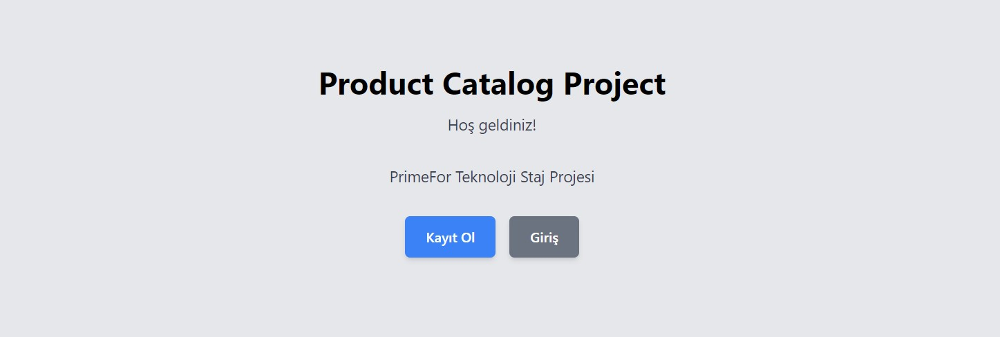

Kayıt Ol ekranı: 
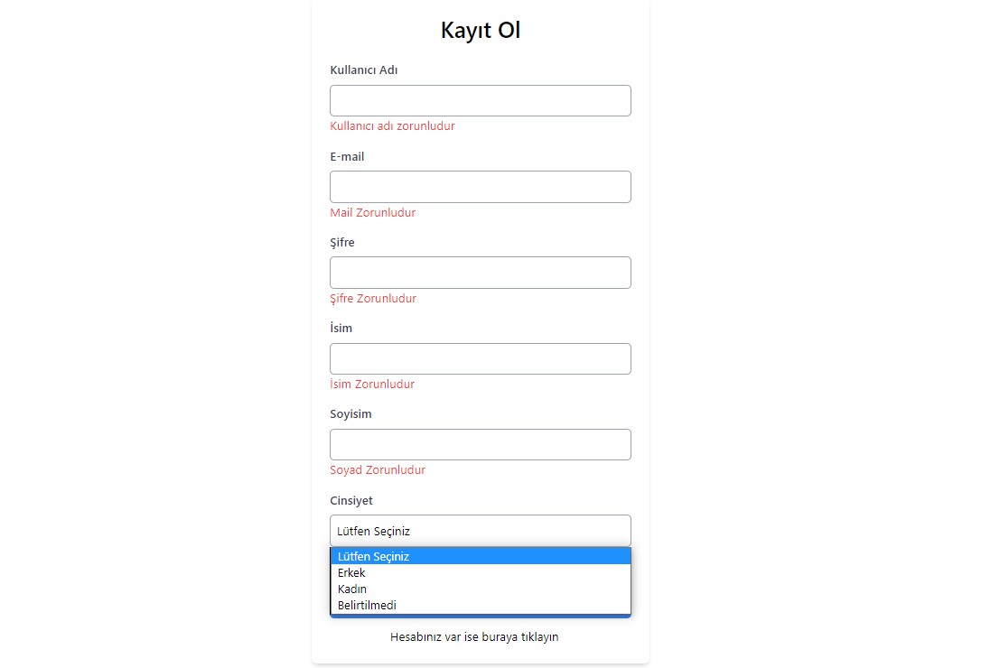

Giriş yapma ekranı:
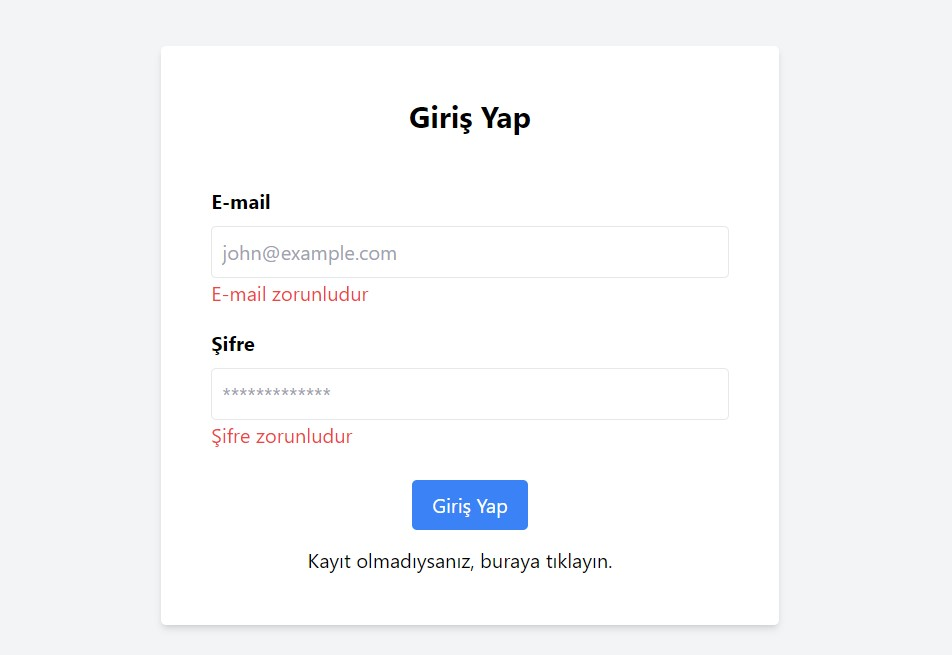

Giriş Yaptıktan sonraki yönlendirilen ekran:
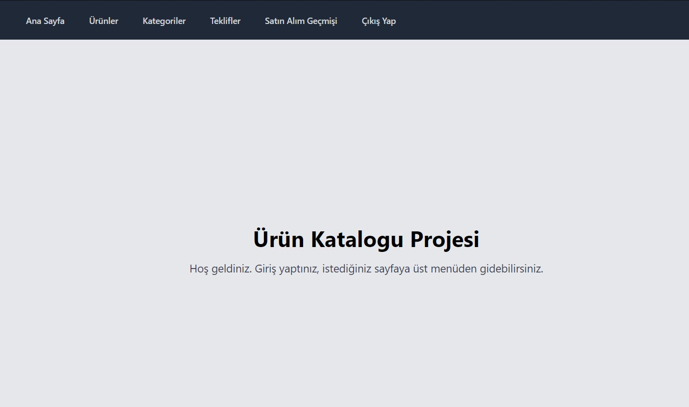

Ürünler bu ekranda kategoriye göre listelenebiliyor. Ürün Ekle butonuna tıklandığında bir pop up açılıyor.
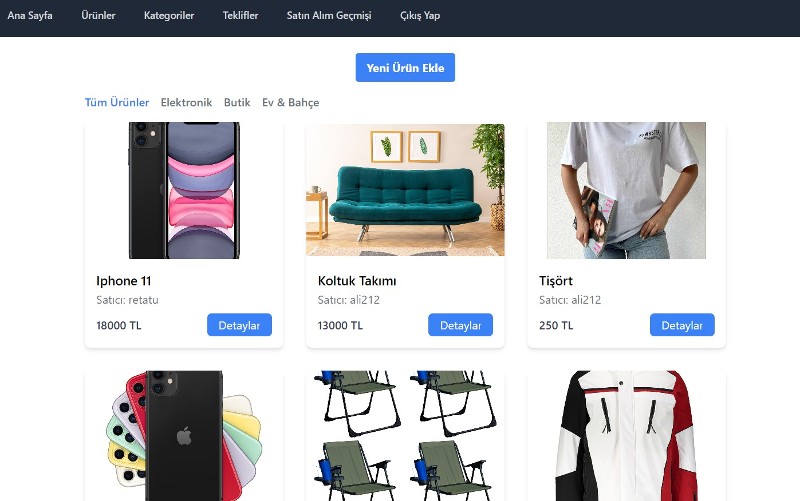

Ürün eklerken database üzerinde bulunan verileri çekerek. Kategori, Renk, Durum, Marka seçilebiliyor. Ürünü teklife açık bir şekilde yükleyebiliyorsunuz.
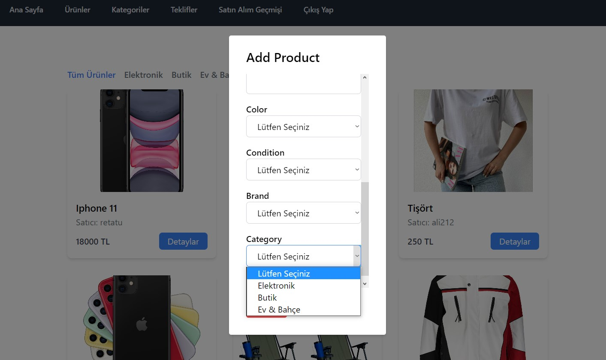

Ürün detayları sayfasında ürüne ait açıklamayı bulabiliyorsunuz. Teklif Ver ve Satın Al butonlarından seçimizini yapıyorsunuz.
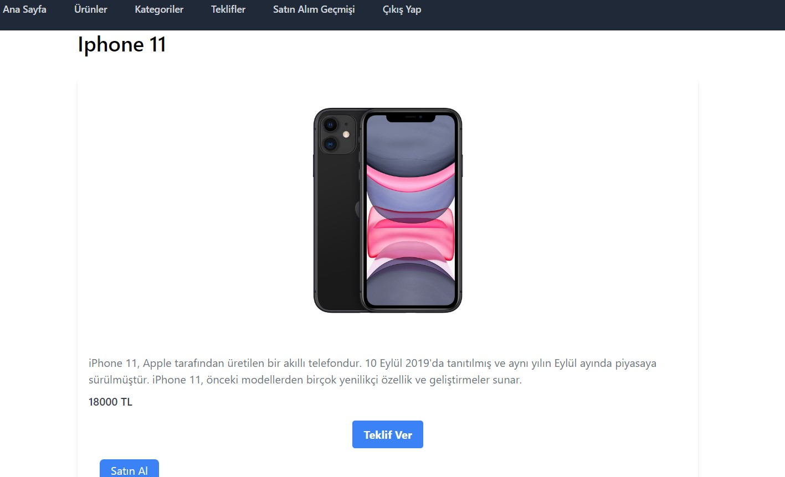

Yüzdelik teklif seçeneği de bu durumda mevcut hale geliyor. Örneğin 100 TL'lik ürüne %40 teklif yaparsanız 40 TL teklif yapmış oluyorsunuz.
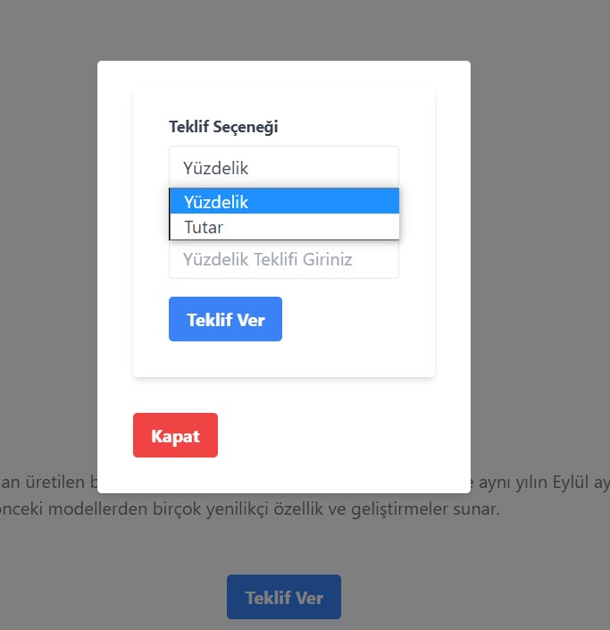

Yapılan teklifleri ve yapmış olduğumuz teklifleri görebiliyoruz. Geri Çek butonu tetiklendiğinde teklif siliniyor. Yapılan tekliflere ise onayla ve reddet butonları ile yönlendirebiliyoruz. Reddedilen teklif siliniyor, onaylanan teklif ise bir daha onaylanmaması için buton disabled durumuna geliyor.
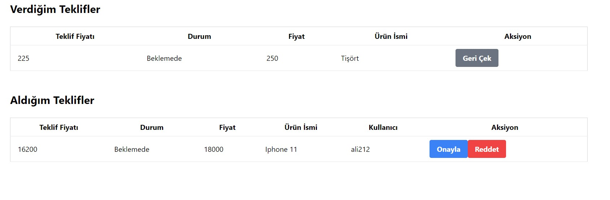

Kategoriler burada listeleniyor ve aynı zamanda kategori eklemek için butona tıklandığında pop up açılıyor. Açılan pop up da kategori ekleme işlemlerini tamamlıyoruz. Düzenleme ve silme işlemleri için butonlara basıldığı taktirde gerekli işlemler gerçekleşiyor.
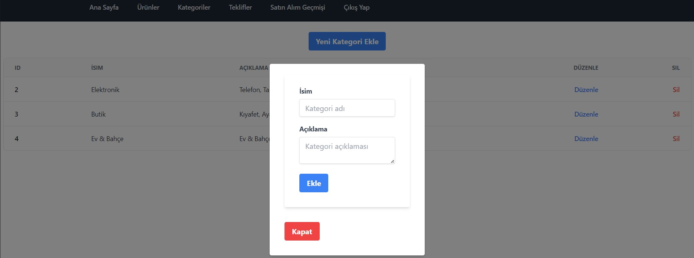

Satın alınmış ve satılan ürünleri burada görebiliyorsunuz.
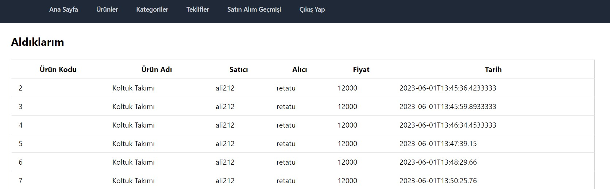

Hoşgeldin Maili:
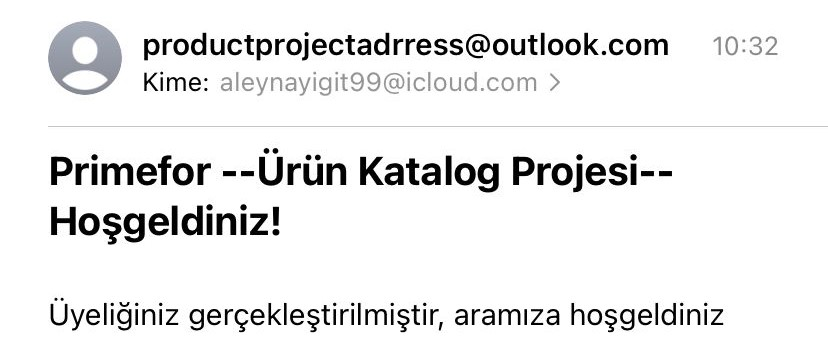

Blok Maili:
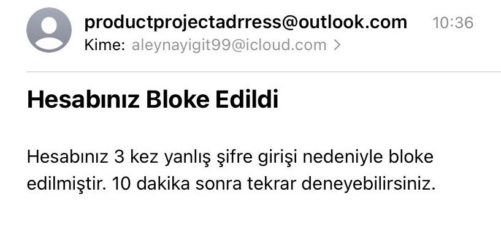